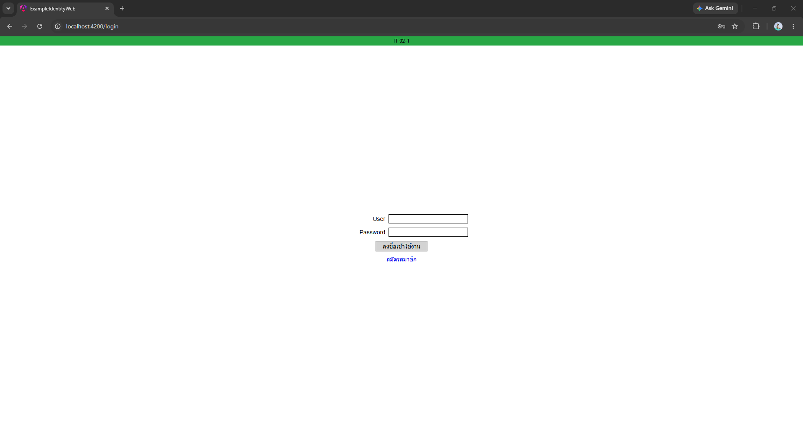
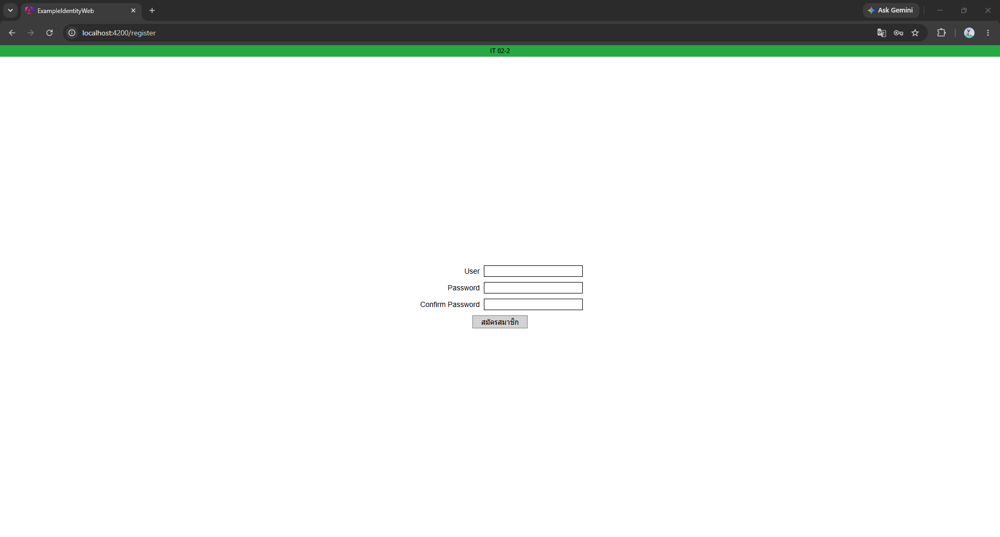
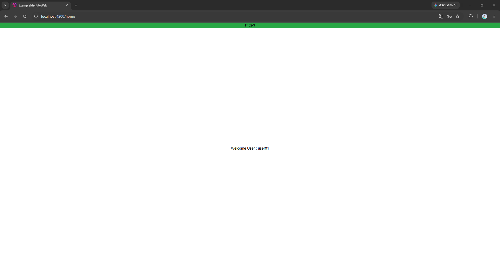

# Example Identity Authentication

A simple full-stack authentication system developed as a technical assessment.

## Screenshots

### Login



### Register



### Home



## Tech Stack

### Backend
- ASP.NET Core Web API
- Entity Framework Core
- SQL Server
- JWT Authentication
- BCrypt.Net Password Hashing
- Swagger

### Frontend
- Angular
- TypeScript
- HttpClient

---

## Features

- User Registration
- User Login
- Password hashing using BCrypt
- JWT Authentication
- Protected API endpoint (`GET /api/auth/me`)
- Display authenticated username after login

---

## Project Structure

```
ExampleIdentity
│
├── Example.Identity.Api
│   ├── Controllers
│   ├── Services
│   ├── Repositories
│   ├── Data
│   └── ...
│
└── example-identity-web
    ├── src
    ├── pages
    ├── services
    └── ...
```

---

## How to Run

### Backend

1. Open `Example.Identity.Api`
2. Update the SQL Server connection string in `appsettings.json`
3. Apply migrations

```bash
dotnet ef database update
```

4. Run the API

```bash
dotnet run
```

Swagger

```
http://localhost:5241/swagger
```

---

### Frontend

```bash
npm install
ng serve
```

Angular

```
http://localhost:4200
```

---

## Authentication Flow

```
Register
    ↓
Password hashed using BCrypt
    ↓
Stored in SQL Server
    ↓
Login
    ↓
JWT Token generated
    ↓
Angular stores token in Local Storage
    ↓
Call protected API (/api/auth/me)
    ↓
Display authenticated username
```

---

## Notes

This project was implemented with a focus on clean separation between backend and frontend while keeping the implementation simple and easy to review.
